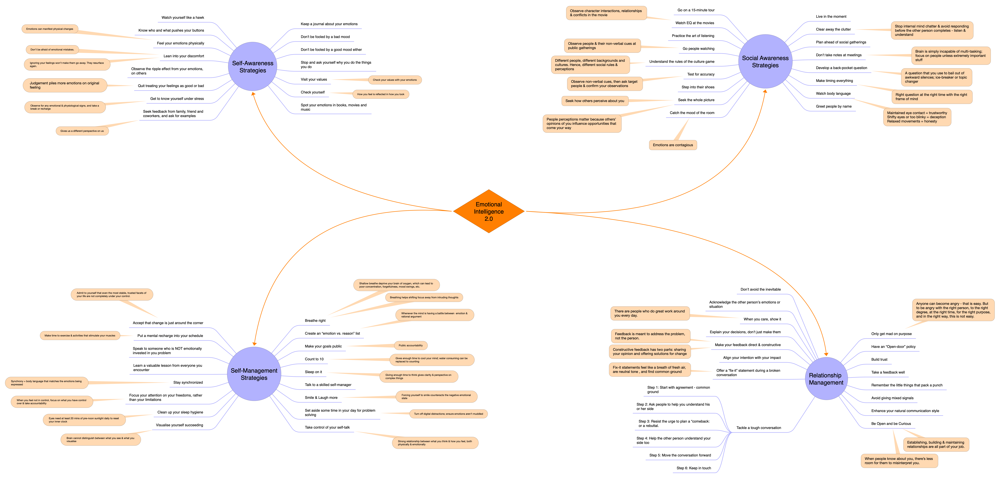

# Emotional Intelligence 2.0

### Travis Bradberry & Jean Greaves

---

- Emotional intelligence is your ability to recognize and understand emotions in yourself and others, and your ability to use this awareness to manage your behavior and relation ships.

- Emotional intelligence is a skill set that can be learned-and unlearned. Just as you can work hard to lose weight over the summer only to pack those pounds on again over the winter holidays.

- IQ, EQ and personality assessed together are the best way get a picture of the whole person. When you measure all three in a single individual, they don't overlap much. Instead, each covers unique ground that helps to explain what makes a person tick.

- When something generates a prolonged emotional reaction in you, it's called a "trigger event. Your reaction to your triggers is shaped by your personal history, which includes your experience with similar situations.

- When you don't take time out to notice and understand your emotions, they have a strange way of resurfacing when you least expect or want them to. It's their way of trying to bring something important to your attention. They will persist, and the damage will mount, until you take notice.

- Your hard-wired emotional reactions to anything come before you even have a chance to respond.

- Emotional intelligence skills-much like emotions themselves-are contagious. That means that our EQ skills are highly dependent on the surrounding people and circumstances. The more we interact with empathetic people, the more empathetic we become. The more time we spend with other people who openly discuss emotions, the more skilled we become at identifying and understanding emotions.

> Real results come from putting your momentary needs on hold to pursue larger, more important goals.

---

- **_Self-management_** Is more than resisting explosive or problematic behaviour. The biggest challenge that people face is managing their tendencies over time and applying their skills in a variety of situations.

- The surprising thing about self-awareness is that just thinking about it helps you improve the skill, even though much of your focus initially tends to be on what you do wrong. Having self-awareness means you aren't afraid of your emotional "mistakes."

- People high in self-awareness are remarkably clear in their understanding of what they do well, what motivates and satisfies them, and which people and situations push their buttons.

- The only way to genuinely understand your emotions is to spend enough time thinking through them to figure out where they come from and why they are there.

> **SELF-AWARENESS STRATEGIES**
>
> 1. Quit Treating Your Feelings as Good or Bad
> 2. Observe the Ripple Effect from Your Emotions
> 3. Lean into Your Discomfort
> 4. Feel Your Emotions Physically
> 5. Know Who and What Pushes Your Buttons
> 6. Watch Yourself Like a Hawk.
> 7. Keep a Journal about Your Emotions
> 8. Don't Be Fooled by a Bad Mood
> 9. Don't Be Fooled by a Good Mood, Either
> 10. Stop and Ask Yourself Why You Do the Things You Do
> 11. Visit Your Values
> 12. Check Yourself
> 13. Spot Your Emotions in Books, Movies, and Music
> 14. Seek Feedback
> 15. Get to Know Yourself under Stress

- _SELF-AWARENESS ACTIVITY 1_ : Observer physical changes & cues when you are happy, excited, sad or depressed from head to toe. Think about the events that have triggered strong emotions - both positive and negative - and take a not of physical differences. Next time, when confused about your emotions, observe your physical signs.

- _SELF-AWARENESS ACTIVITY 2_: Take a sheet of paper and separate it into two columns. List your core values and beliefs in the left column and anything that you've done or said recently that you aren't proud of in the right column. Is what you value in alignment with the manner in which you conduct yourself? If not, consider alternatives to what you said and did that would have made you proud of yourself, or at least more comfortable.

- _SELF-AWARENESS ACTIVITY 3_: Taking a moment here and there to check yourself will allow you to understand your mood before it sets the tone for the rest of your day.

---

> **SELF-MANAGEMENT STRATEGIES**
>
> 1. Breathe Right
> 2. Create an Emotion vs. Reason List
> 3. Make Your Goals Public
> 4. Count to Ten
> 5. Sleep On It
> 6. Talk To a Skilled Self-Manager
> 7. Smile and Laugh More
> 8. Set Aside Some Time in Your Day for Problem Solving
> 9. Take Control of Your Self-Talk
> 10. Visualize Yourself Succeeding
> 11. Clean Up Your Sleep Hygiene
> 12. Focus Your Attention on Your Freedoms, Rather than Your Limitations
> 13. Stay Synchronized
> 14. Speak to Someone Who is Not Emotionally Invested in Your Problem
> 15. Learn a Valuable Lesson from Everyone You Encounter
> 16. Put a Mental Recharge into Your Schedule
> 17. Accept That Change is Just around the Corner

---

- _SELF-MANAGEMENT ACTIVITY 1_: The next time you are in a stressful or emotional situation, focus on taking slow deep breaths, inhaling through your nose until you can feel your stomach swell outward and grow tight, and tight then exhaling gently and completely through your mouth. As you exhale, go ahead and push that breath out until you have completely emptied your lungs.

- _SELF-MANAGEMENT ACTIVITY 2_: Much of self-management comes down to motivation, and you can use the expectation that other people have of you as a powerful force to get you up off the proverbial couch.

- _SELF-MANAGEMENT ACTIVITY 3_: A great time to visualize is before you go to bed at night. Just close your eyes and visualize yourself in situations where you have the most difficulty managing yourself. Focus on the details of each situation that make it so hard for you to remain in control; concentrate on the sights and sounds you would experience if you were actually there until you literally feel the same emotions. Next, picture yourself acting the way you'd like to (i.e., calming your nerves and proceeding confidently during a big presentation, dealing with someone who pushes your buttons without loosing your cool, etc.)

---

- In the end, no man is an island; relationships are an essential and fulfilling part of life. Since you are half of any relationship, you have half of the responsibility of deepening these connections.

> Working on a relationship takes time, effort, and know-how. The know-how is emotional intelligence.

- **_Social awareness_** is your ability to accurately pick up on emotions in other people and understand what is really going on with them.

- It's easy to get caught up in your own emotions and forget to consider the perspective of the other party. Social awareness ensures you Stay focused and absorb critical information.

- The lens you look through must be clear. Making sure you are present and able to give others your full attention is the first step to becoming more socially aware. Looking outward isnt just about using your eyes: it means tapping into your senses. Not only can you fully utilize your basic five senses, but you can also include the vast amount of information coming into your brain through your sixth sense, your emotions. Your emotions can help you notice and interpret cues other people send you. These cues will give you some help in putting yourself in the other person's shoes.

> **SOCIAL AWARENESS STRATEGIES**
>
> 1. Greet People by Name
> 2. Watch Body Language
> 3. Make Timing Everything
> 4. Develop a Back-pocket Question
> 5. Don't Take Notes at Meetings
> 6. Plan Ahead for Social Gatherings
> 7. Clear Away the Clutter
> 8. Live in the Moment
> 9. Go on a 15-minute Tour
> 10. Watch EQ at the Movies
> 11. Practice the Art of Listening
> 12. Go People Watching
> 13. Understand the Rules of the Culture Game
> 14. Test for Accuracy
> 15. Step into Their Shoes
> 16. Seek the Whole Picture
> 17. Catch the Mood of the Room

---

- **_Relationship management_** is your ability to use your awareness of your own emotions and those of others to manage interactions successfully. This skill often taps into your abilities in the first three emotional intelligence skills: self-awareness, self-management, and social awareness.

- If you want people to listen, you have to practice relationship management and seek benefits from every relationship, especially the challenging ones. The difference between an interaction and a relationship is a matter of frequency. It's a product of the quality, depth, and time you spend interacting with another person. Relationship management poses the greatest challenge for most people during times of stress.

> **RELATIONSHIP MANAGEMENT STRATEGIES**
>
> 1. Be Open and Be Curious
> 2. Enhance Your Natural Communication Style
> 3. Avoid Giving Mixed Signals
> 4. Remember the Little Things That Pack a Punch
> 5. Take Feedback Well
> 6. Build Trust
> 7. Have an "Open-door" Policy
> 8. Only Get Mad on Purpose
> 9. Don't Avoid the Inevitable
> 10. Acknowledge the Other Person's Feelings
> 11. Complement the Person's Emotions or Situation
> 12. When You Care, Show It
> 13. Explain Your Decisions, Don't Just Make Them
> 14. Make Your Feedback Direct and Constructive
> 15. Align Your Intention with Your Impact
> 16. Offer a "Fix-it" Statement during a Broken Conversation
> 17. Tackle a Tough Conversation

---

- _RELATIONSHIP MANAGEMENT ACTIVITY 1_: On the left side of the paper, jot down the upsides of your natural style. These are the things people appreciate about you interact with them. On the right side, list the downsides or things that have created confusion, weird reactions, or trouble. Once your list is complete, choose three upsides that you can use more to improve your communication. Next, choose three downsides, and think about ways you can either eliminate, downplay, or improve them. Be honest with yourself about what you will or won't do.

- _RELATIONSHIP MANAGEMENT ACTIVITY 2_: For the next month, pay close attention to matching your tone and body language to what you are really trying to say. Take mental note of those moments when you tell someone that you are feeling fine, but your body, tone or demeanor is sending drastically different signals. When you catch yourself sending a mixed signal, readjust to match it or explain it.

---

- Middle managers stand out, with the highest EQ scores in the workforce. But up beyond middle management, there is a steep downward trend in EQ scores. For the titles of director and above, scores descend faster than a snowboarder on a black diamond. CEOS, on average, have the lowest EQ in the workplace.

- A full 70% of male leaders who rank in the top 15% in decision-making skills also score the highest in emotional intelligence skills.

- Women out performed men in self-management, social awareness, and relationship management. In fact, self-awareness was the only EQ skill in which men were able to keep pace with women.

- Under stress-free conditions, we can consciously devote extra effort to staying calm and collected during the trials and tribulations of everyday life. We are more confident in our abilities to handle unexpected events, and we allow our minds to overcome troublesome matters. Unmanaged stress, however, consumes much of those mental resources. It reduces our minds to something like a state of martial law in which emotions single-handedly dictate behavior, while our rational capacities are busy trying to turn lemons into lemonade. Suddenly, a little set back in your project at work that would have been no big deal in relatively prosperous times feels more like a catastrophe than a minor nuisance. For many people, their EQ skills desert them at precisely the time when they need these skills the most-under stress. Only those with well-trained and almost second-nature EQ skills can effectively weather the storm.

