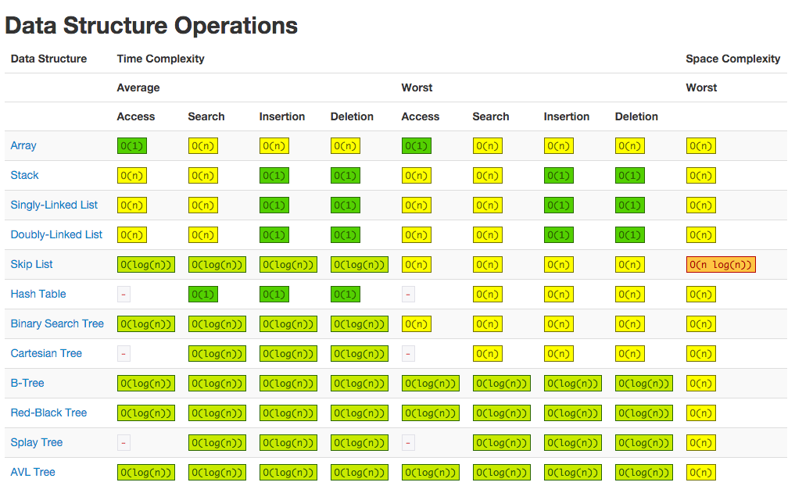
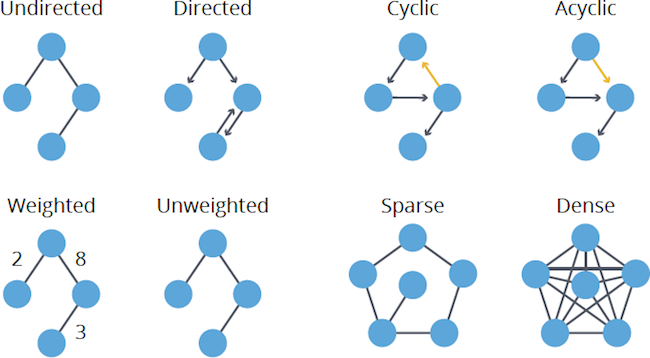

# Grokking Algorithms

- `log10 100` is like asking, “How many 10s do we multiply together to get 100?” The answer is 2: 10 × 10. So `log10 100 = 2`. Logs are the flip of exponentials.

- It’s not enough to know how long an algorithm takes to run — you need to know how the running time increases as the list size increases. That’s where **_Big O_** notation comes in.

- **_Big O_** doesn’t tell you the speed in seconds. Big O notation lets you compare the number of operations. It tells you how fast the algorithm grows.

> Big O notation is about the worst-case scenario.

- Here are five Big O run times that you’ll encounter a lot, sorted from fastest to slowest:

  1.  `O(log n)`, also known as log time. Example: Binary search.
  2.  `O(n)`, also known as linear time. Example: Simple search.
  3.  `O(n * log n)`. Example: A fast sorting algorithm, like quicksort.
  4.  `O(n^2)`. Example: A slow sorting algorithm, like selection sort.
  5.  `O(n!)`. Example: A really slow algorithm, like the traveling salesperson

> 

- For now, the main takeaways are as follows:

  1. Algorithm speed isn’t measured in seconds, but in growth of the number of operations. Instead, we talk about how quickly the run time of an algorithm increases as the size of the input increases.
  2. Run time of algorithms is expressed in Big O notation. `O(log n)` is faster than `O(n)`, but it gets a lot faster as the list of items you’re searching grows.

> 

> 

- **_Linked lists_** are great if you’re going to read all the items one at a time: you can read one item, follow the address to the next item, and so on. But if you’re going to keep jumping around, linked lists are terrible.

- **_Arrays_** are great if you want to read random elements, because you can look up any element in your array instantly.

> Unlike insertions, deletions will always work. Insertions can fail sometimes when there’s no space left in memory. But you can always delete an element.

- Which are used more: arrays or lists? Obviously, it depends on the use case. But arrays see a lot of use because they allow random access.

> 

- There are two different types of access: random access and sequential access.
  1.  **_Sequential access_** means reading the elements one by one, starting at the first element. Linked lists can only do sequential access. If you want to read the 10th element of a linked list, you have to read the first 9 elements and follow the links to the 10th element.
  2.  **_Random access_** means you can jump directly to the 10th element. You’ll frequently hear me say that arrays are faster at reads. This is because they provide random access. A lot of use cases require random access, so arrays are used a lot. Arrays and lists are used to implement other data structures

> Arrays allow fast reads. Linked lists allow fast inserts and deletes.

- **_Recursion_** is where a function calls itself.

> Recursion is used when it makes the solution clearer. There’s no performance benefit to using recursion; in fact, loops are sometimes better for performance.

> “Loops may achieve a performance gain for your program. Recursion may achieve a performance gain for your programmer. Choose which is more important in your situation!”

- That’s why every recursive function has two parts: the base case, and the recursive case. The recursive case is when the function calls itself. The base case is when the function doesn’t call itself again ... so it doesn’t go into an infinite loop.

- When you call a function from another function, the calling function is paused in a partially completed state. All the values of the variables for that function are still stored in memory.

- This stack, used to save the variables for multiple functions, is called the call stack.

- Using the stack is convenient because you don’t have to keep track of a pile of boxes yourself—the stack does it for

- Using the stack is convenient, but there’s a cost: saving all that info can take up a lot of memory. Each of those function calls takes up some memory, and when your stack is too tall, that means your computer is saving information for many function calls. At that point, you have two options: You can rewrite your code to use a loop instead. You can use something called tail recursion. That’s an advanced recursion topic that is out of the scope of this book. It’s also only supported by some languages, not all.

> 

- Recursion is when a function calls itself. Every recursive function has two cases: the base case and the recursive case. A stack has two operations: push and pop. All function calls go onto the call stack. The call stack can get very large, which takes up a lot of memory.

- To solve a problem using D&C, there are two steps:

  1. Figure out the base case. This should be the simplest possible case.
  2. Divide or decrease your problem until it becomes the base case.

- Recursion keeps track of the state.

- When you’re writing a recursive function involving an array, the base case is often an empty array or an array with one element. If you’re stuck, try that first.

- For example, the C standard library has a function called qsort, which is its implementation of quicksort. Quicksort also uses D&C.

- This is called partitioning. Now you have A sub-array of all the numbers less than the pivot The pivot A sub-array

- Inductive proofs are one way to prove that your algorithm works. Each inductive proof has two steps: the base case and the inductive case.

- But sometimes the constant can make a difference. Quicksort versus merge sort is one example. Quicksort has a smaller constant than merge sort. So if they’re both `O(n log n)` time, quicksort is faster. And quicksort is faster in practice because it hits the average case way more often than the worst case.

- In the worst case, the stack size is `O(n)`. In the best case, the stack size is `O(log n)`.

> **_Quick sort_** : Quicksort is one of the fastest sorting algorithms out there, and it’s a very good example of D&C.

> A **_hash function_** is a function where you put in a string and you get back a number.

- The hash function knows how big your array is and only returns valid indexes. So if your array is 5 items, the hash function doesn’t return 100 ... that wouldn’t be a valid index in the array.

- Put a hash function and an array together, and you get a data structure called a **_hash table_**. A hash table is the first data structure you’ll learn that has some extra logic behind it. Arrays and lists map straight to memory, but hash tables are smarter. They use a hash function to intelligently figure out where to store elements.

- They’re also known as hash maps, maps, dictionaries, and associative arrays.

> 

- Wow, mapping a web address to an IP address? Sounds like a perfect use case for hash tables! This process is called DNS resolution. Hash tables are one way to provide this functionality.

- Checking for duplicates is very fast with a hash table.

> Caching is a common way to make things faster. All big websites use caching. And that data is cached in a hash!

- Facebook isn’t just caching the home page. It’s also caching the About page, the Contact page, the Terms and Conditions page, and a lot more. So it needs a mapping from page URL to page data.

- Modeling relationships from one thing to another thing Filtering out duplicates Caching/memorizing data instead of making your server do

- This is called a **_collision_**: two keys have been assigned the same slot.

- There are many different ways to deal with collisions. The simplest one is this: if multiple keys map to the same slot, start a linked list at that slot.

- Hash functions are important. A good hash function will give you very few collisions.

- In the average case, hash tables take `O(1)` for everything. `O(1)` is called constant time.

- Hash tables are as fast as arrays at searching (getting a value at an index). And they’re as fast as linked lists at inserts and deletes. It’s the best of both worlds! But in the worst case, hash tables are slow at all of those.

- To avoid collisions, you need A low load factor A good hash function

- Having a load factor greater than 1 means you have more items than slots in your array. Once the load factor starts to grow, you need to add more slots to your hash table. This is called resizing.

- A good rule of thumb is, resize when your load factor is greater than 0.7.

- Resizing is expensive, and you don’t want to resize too often. But averaged out, hash tables take `O(1)` even with resizing.

- A good hash function distributes values in the array evenly.

- The algorithm found that the shortest route to the bridge is three steps long. This type of problem is called a **_shortest-path problem_**. You’re always trying to find the shortest something. It could be the shortest route to your friend’s house. It could be the smallest number of moves to checkmate in a game of chess. The algorithm to solve a shortest-path problem is called breadth-first search.

> A graph models a set of connections.

- Each graph is made up of nodes and edges.

- A node can be directly connected to many other nodes. Those nodes are called its neighbors.

- **_Queues_** are similar to stacks. You can’t access random elements in the queue. Instead, there are two only operations, enqueue and dequeue.

> The queue is called a FIFO data structure: First In, First Out. In contrast, a stack is a LIFO data structure: Last In, First Out.

- Hash tables have no ordering, so it doesn’t matter what order you add key/value pairs in.

- Directed graph — the relationship is only one way.

- An undirected graph doesn’t have any arrows, and both nodes are each other’s neighbors

- When updating queues, I use the terms enqueue and dequeue. You’ll also encounter the terms push and pop. Push is almost always the same thing as enqueue, and pop is almost always the same thing as dequeue.

- If task A depends on task B, task A shows up later in the list. This is called a topological sort, and it’s a way to make an ordered list out of a graph.

- You could topologically sort the graph and get a list of tasks to do, in order.

> A **_tree_** is a special type of graph, where no edges ever point back.

> 

- **_Breadth-first search_** tells you if there’s a path from A to B. If there’s a path, breadth-first search will find the shortest path. If you have a problem like “find the shortest X,” try modeling your problem as a graph, and use breadth-first search to solve. A directed graph has arrows, and the relationship follows the direction of the arrow (rama -> adit means “rama owes adit money”). Undirected graphs don’t have arrows, and the relationship goes both ways (ross - rachel means “ross dated rachel and rachel dated ross”). Queues are FIFO (First In, First Out). Stacks are LIFO (Last In, First Out). You need to check people in the order they were added to the search list, so the search list needs to be a queue. Otherwise, you won’t get the shortest path. Once you check someone, make sure you don’t check them again. Otherwise, you might end up in an infinite loop.

- There are four steps to **_Dijkstra’s algorithm_**:

  1. Find the “cheapest” node. This is the node you can get to in the least amount of time.
  2. Update the costs of the neighbors of this node. I’ll explain what I mean by this shortly.
  3. Repeat until you’ve done this for every node in the graph.
  4. Calculate the final path.

> 

> 

- But in Dijkstra’s algorithm, you assign a number or weight to each segment. Then Dijkstra’s algorithm finds the path with the smallest total weight.

- When you work with Dijkstra’s algorithm, each edge in the graph has a number associated with it. These are called weights.

- A graph with weights is called a **_weighted graph_**. A graph without weights is called an **_unweighted graph_**.

- To calculate the shortest path in an unweighted graph, use breadth-first search. To calculate the shortest path in a weighted graph, use Dijkstra’s algorithm.

- Graphs can also have cycles.

- An undirected graph means that both nodes point to each other. That’s a cycle!

> Dijkstra’s algorithm only works with directed acyclic graphs, called DAGs for short.

- that the shortest path doesn’t have to be about physical distance

> You can’t use Dijkstra’s algorithm if you have negative-weight edges. Negative-weight edges break the algorithm.

- So you can’t use negative-weight edges with Dijkstra’s algorithm. If you want to find the shortest path in a graph that has negative-weight edges, there’s an algorithm for that! It’s called the Bellman-Ford algorithm.

- The cost of a node is how long it takes to get to that node from the start.

- Breadth-first search is used to calculate the shortest path for an unweighted graph. Dijkstra’s algorithm is used to calculate the shortest path for a weighted graph.

> Dijkstra’s algorithm works when all the weights are positive. If you have negative weights, use the Bellman-Ford algorithm.

- But that’s the beauty of greedy algorithms: they’re easy! A greedy algorithm is simple: at each step, pick the optimal move.

- In technical terms: at each step you pick the locally optimal solution, and in the end you’re left with the globally optimal solution.

- **_Approximation algorithm_**: When calculating the exact solution will take too much time, an approximation algorithm will work. Approximation algorithms are judged by How fast they are How close they are to the optimal solution.

- **_Greedy algorithms_** are a good choice because not only are they simple to come up with, but that simplicity means they usually run fast, too.

- A **_set_** is like a list, except that each item can show up only once in a set. Sets can’t have duplicates.

- You can do some interesting operations on sets, like union, intersection, and difference.

- **_The traveling-salesperson problem_** and the set-covering problem both have something in common: you calculate every possible solution and pick the smallest/shortest one. Both of these problems are NP-complete.

- **_NP-complete problems_** show up everywhere! It’s nice to know if the problem you’re trying to solve is NP-complete. At that point, you can stop trying to solve it perfectly, and solve it using an approximation algorithm instead. But it’s hard to tell if a problem you’re working on is NP-complete. Usually there’s a very small difference between a problem that’s easy to solve and an NP-complete problem

- There’s no easy way to tell if the problem you’re working on is NP-complete. Here are some giveaways:
  1.  Your algorithm runs quickly with a handful of items but really slows down with more items. “All combinations of X” usually point to an NP-complete problem.
  2.  Do you have to calculate “every possible version” of X because you can’t break it down into smaller sub-problems? Might be NP-complete.
  3.  If your problem involves a sequence (such as a sequence of cities, like traveling salesperson), and it’s hard to solve, it might be NP-complete.
  4.  If your problem involves a set (like a set of radio stations) and it’s hard to solve, it might be NP-complete.
  5.  Can you restate your problem as the set-covering problem or the traveling-salesperson problem? Then your problem is definitely NP-complete.

> Greedy algorithms optimize locally, hoping to end up with a global optimum. NP-complete problems have no known fast solution. If you have an NP-complete problem, your best bet is to use an approximation algorithm. Greedy algorithms are easy to write and fast to run, so they make good approximation algorithms.

- **_Dynamic programming_** starts by solving subproblems and builds up to solving the big problem.

- Dynamic programming is powerful because it can solve subproblems and use those answers to solve the big problem. Dynamic programming only works when each subproblem is discrete—when it doesn’t depend on other subproblems.

- It can be hard to come up with a dynamic-programming solution. That’s what we’ll focus on in this section. Some general tips follow:
  1.  Every dynamic-programming solution involves a grid.
  2.  The values in the cells are usually what you’re trying to optimize. For the knapsack problem, the values were the value of the goods.
  3.  Each cell is a subproblem, so think about how you can divide your problem into subproblems. That will help you figure out what the axes are.

> 

- The truth is, there’s no easy way to calculate the formula here. You have to experiment and try to find something that works. Sometimes algorithms aren’t an exact recipe. They’re a framework that you build your idea on top of.

- Biologists use the longest common subsequence to find similarities in DNA strands. They can use this to tell how similar two animals or two diseases are. The longest common subsequence is being used to find a cure for multiple sclerosis. Have you ever used diff (like git diff)? Diff tells you the differences between two files, and it uses dynamic programming to do so. We talked about string similarity. Levenshtein distance measures how similar two strings are, and it uses dynamic programming. Levenshtein distance is used for everything from spell-check to figuring out whether a user is uploading copyrighted data. Have you ever used an app that does word wrap, like Microsoft Word? How does it figure out where to wrap so that the line length stays consistent? Dynamic programming!

- Dynamic programming is useful when you’re trying to optimize something given a constraint. You can use dynamic programming when the problem can be broken into discrete subproblems. Every dynamic-programming solution involves a grid. The values in the cells are usually what you’re trying to optimize. Each cell is a subproblem, so think about how you can divide your problem into subproblems. There’s no single formula for calculating a dynamic-programming solution.

- The distance formula is flexible: you could have a set of a million numbers and still use the same old distance formula to find the distance. Maybe you’re wondering, “What does distance mean when you have five numbers?” The distance tells you how similar those sets of numbers are.

> These are the two basic things you’ll do with **_KNN—classification and regression_**: Classification = categorization into a group Regression = predicting a response (like a number)

- Cosine similarity doesn’t measure the distance between two vectors. Instead, it compares the angles of the two vectors. It’s better at dealing with cases like this.

- When you’re working with KNN, it’s really important to pick the right features to compare against. Picking the right features means Features that directly correlate to the movies you’re trying to recommend Features that don’t have a bias (for example, if you ask the users to only rate comedy movies, that doesn’t tell you whether they like action movies)

- Spam filters use another simple algorithm called the **_Naive Bayes classifier_**. First, you train your Naive Bayes classifier on some data.

- KNN is used for classification and regression and involves looking at the k-nearest neighbors. Classification = categorization into a group. Regression = predicting a response (like a number). Feature extraction means converting an item (like a fruit or a user) into a list of numbers that can be compared. Picking good features is an important part of a successful KNN algorithm.

- **_Binary search trees_** have some downsides too: for one thing, you don’t get random access.

- **_B-trees_**, a special type of binary tree, are commonly used to store data in databases. If you’re interested in databases or more-advanced data structures, check these out: B-trees Red-black trees Heaps Splay trees

- a hash that maps words to places where they appear. This data structure is called an **_inverted index_**, and it’s commonly used to build search engines. If you’re interested in search, this is a good place to start.

- The **_Fourier transform_** is great for processing signals. You can also use it to compress music. First you break an audio file down into its ingredient notes. The Fourier transform tells you exactly how much each note contributes to the overall song. So you can just get rid of the notes that aren’t important. That’s how the MP3 format works!

- Music isn’t the only type of digital signal. The JPG format is another compressed format, and it works the same way. People use the Fourier transform to try to predict upcoming earthquakes and analyze DNA. You can use it to build an app like Shazam, which guesses what song is playing.

- To make your algorithms faster, you need to change them to run in parallel across all the cores at once!

- **_The distributed algorithm_**. It’s fine to run a parallel algorithm on your laptop if you need two to four cores, but what if you need hundreds of cores? Then you can write your algorithm to run across multiple machines. The **_MapReduce algorithm_** is a popular distributed algorithm. You can use it through the popular open source tool Apache Hadoop.

- Distributed algorithms are great when you have a lot of work to do and want to speed up the time required to do it. MapReduce in particular is built up from two simple ideas: the map function and the reduce function.

- MapReduce uses these two simple concepts to run queries about data across multiple machines. When you have a large dataset (billions of rows), MapReduce can give you an answer in minutes where a traditional database might take hours.

- **_Bloom filters_** are probabilistic data structures. They give you an answer that could be wrong but is probably correct.

- Bloom filters are great because they take up very little space. A hash table would have to store every URL crawled by Google, but a bloom filter doesn’t have to do that. They’re great when you don’t need an exact answer,

- **_HyperLogLog_** approximates the number of unique elements in a set.

- If you have a lot of data and are satisfied with approximate answers, check out probabilistic algorithms!

- **_SHA (Secure Hashing Algorithm)_** is a hash function. It generates a hash, which is just a short string. The hash function for hash tables went from string to array index, whereas SHA goes from string to string.

- SHA generates a different hash for every string.

- SHA hashes are long.

- You can use SHA to tell whether two files are the same. This is useful when you have very large files. Suppose you have a 4 GB file. You want to check whether your friend has the same large file. You don’t have to try to email them your large file. Instead, you can both calculate the SHA hash and compare it.

- SHA is also useful when you want to compare strings without revealing what the original string was.

- SHA is actually a family of algorithms: SHA-0, SHA-1, SHA-2, and SHA-3. As of this writing, SHA-0 and SHA-1 have some weaknesses. If you’re using an SHA algorithm for password hashing, use SHA-2 or SHA-3. The gold standard for password-hashing functions is currently bcrypt (though nothing is foolproof).

- **_Simhash_** comes in. If you make a small change to a string, Simhash generates a hash that’s only a little different. This allows you to compare hashes and see how similar two strings are, which is pretty useful!

- Google uses Simhash to detect duplicates while crawling the web. A teacher could use Simhash to see whether a student was copying an essay from the web. Scribd allows users to upload documents or books to share with others. But Scribd doesn’t want users uploading copyrighted content! The site could use Simhash to check whether an upload is similar to a Harry Potter book and, if so, reject it automatically.

- **_Diffie-Hellman_** solves both problems: Both parties don’t need to know the cipher. So we don’t have to meet and agree to what the cipher should be. The encrypted messages are extremely hard to decode.

- Diffie-Hellman has two keys: a public key and a private key. The public key is exactly that: public. You can post it on your website, email it to friends, or do anything you want with it. You don’t have to hide it. When someone wants to send you a message, they encrypt it using the public key. An encrypted message can only be decrypted using the private key. As long as you’re the only person with the private key, only you will be able to decrypt this message! The Diffie-Hellman algorithm is still used in practice, along with its successor, RSA. If you’re interested in cryptography, Diffie-Hellman is a good place to start: it’s elegant and not too hard to follow.

- **_Linear programming_** is used to maximize something given some constraints.

- Linear programming is a much more general framework, and graph problems are a subset of that.

- Linear programming uses the **_Simplex algorithm_**. It’s a complex algorithm,

### Image Sources

1. Data Structure Operations - [Medium](https://medium.com/@Hollyzhou/data-structure-the-big-o-notation-e3e2405bb8eb)
2. Array & Linked Lists - [Open4Tech](https://open4tech.com/array-vs-linked-list-vs-hash-table/)
3. Array vs Linked Lists - [Medium](https://towardsdatascience.com/linked-lists-vs-arrays-78746f983267)
4. Stack vs Queue - [Medium](https://medium.com/@emmabostian/stacks-vs-queues-in-javascript-1f73a30f296f)
5. Cryptographic Hash functions - [Wikipedia](https://en.wikipedia.org/wiki/Cryptographic_hash_function)
6. Tree Data Structure - [Open4Tech](https://open4tech.com/trees-vs-graphs/)
7. Dijkstra's Algorithm - [rkpandey.com](http://rkpandey.com/AlgorithmHelper/shortest/path/2017/05/16/dijkstra.html)
8. Types of Trees - [Neo4j](https://neo4j.com/blog/graph-algorithms-neo4j-graph-algorithm-concepts/)
9. D&C, Greedy & Dynamic Programming - [Dev.to](https://dev.to/vaidehijoshi/less-repetition-more-dynamic-programming-fl)
10. Big-O Complexity graph - [StackExchange](https://cs.stackexchange.com/questions/95987/which-complexity-represents-a-majority-of-algorithms)
