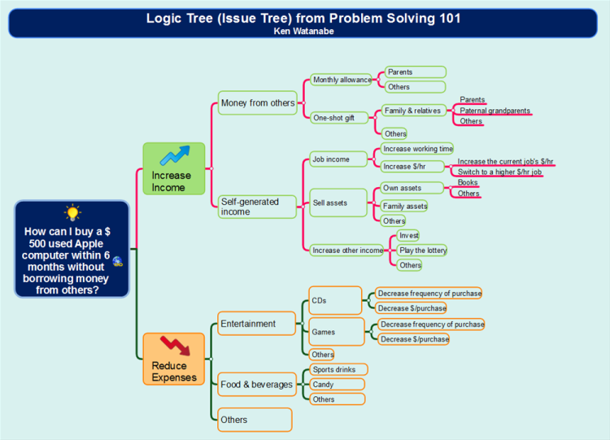
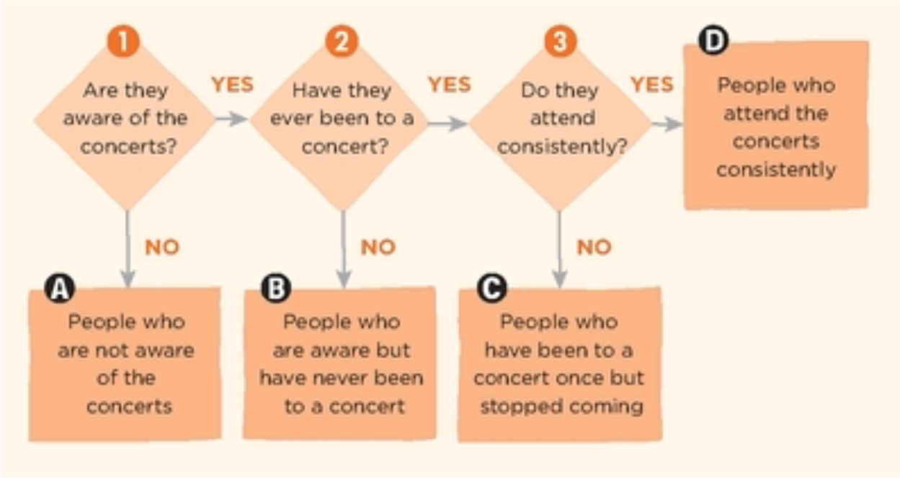
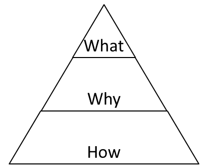
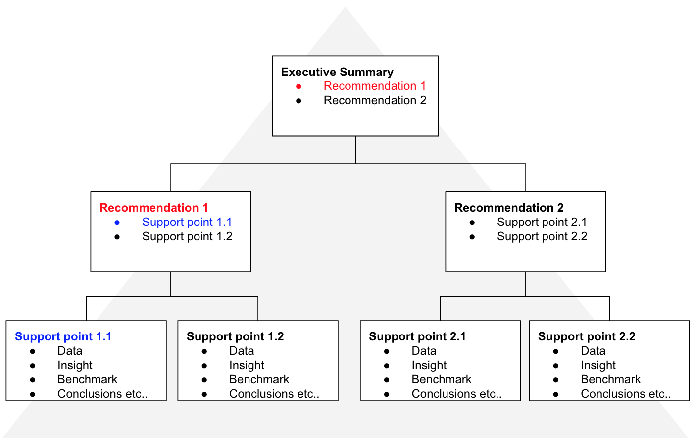
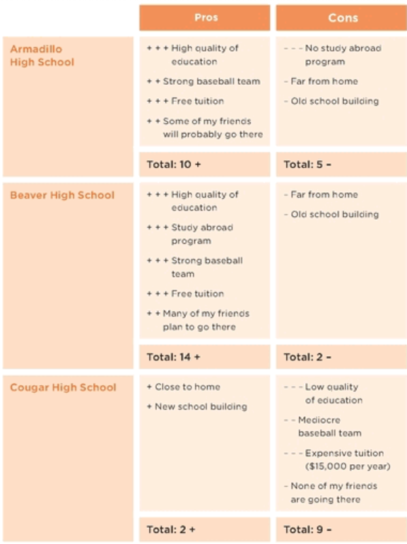
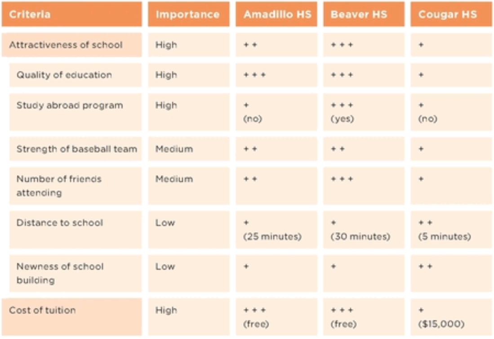

# Problem Solving 101

### Ken Watanabe

- The tool kit of a problem-solving kid includes identifying the root cause of a problem and setting specific goals. They have positive attitudes and stay focused on what can be changed rather than what already happened. They come up with specific action plans to fix their problems and then execute right away. Once they take action, they constantly monitor their own progress.

- WHAT IS PROBLEM SOLVING? Problem solving is a process that can be broken down into four steps:

  1.  Understand the current situation;
  2.  Identify the root cause of the problem;
  3.  Develop an effective action plan; and
  4.  Execute until the problem is solved, making modifications as necessary.

- The key to making a useful **_logic tree_** is to break down a problem into categories without leaving anything out, and to group similar items under the same branch.

> 

- The better you get at understanding the symptoms and identifying the root causes, the better you will get at developing effective solutions.

- Here’s the approach:

  - Step 1: Diagnose the situation and identify the root cause of the problem.
    - List all the potential root causes of the problem.
    - Develop a hypothesis for the likely root cause.
    - Determine the analyses and information required to test the hypothesis.
    - Analyze and identify the root cause.
  - Step 2: Develop the solution.
    - Develop a wide variety of solutions to solve the problem.
    - Prioritize actions.
    - Develop an implementation plan.

- You can use a **_Yes/No tree_** to help you figure out a problem’s root cause or decide how to solve a problem. To create one, you answer multiple yes/no questions.

> 

- If you start collecting and analyzing data without first clarifying the question you are trying to answer, you’re probably doing yourself more harm than good. You’ll end up drowning in a flood of information and realize only later that most of that research was a waste of time.

- There’s a proven problem-solving kids’ process for figuring out how to achieve such a goal.

  - Step 1: Set a clear goal.
  - Step 2: Determine the gap between the goal and the current situation.
  - Step 3: Form a hypothesis about how to close the gap and achieve the goal.
    - List as many options and ideas as possible.
    - Select the best ideas as the hypothesis.
  - Step 4: Check the hypothesis. Go back to step 3 if the hypothesis is disproved.
    - Determine the analyses and information required to test the hypothesis.

- The more specific the goal is, the more specific the action plan will be. Whenever you set a goal, get into the habit of asking yourself, “What specifically do I want to achieve? When do I want to achieve it? What specific conditions do I have?”

- Once you set a clear goal, you need to identify the gap between your goal and your current situation. If the gap is small, the solution may be very obvious. But if the gap is large, you may have to really think through how to achieve the goal.

- To make the tree grow vertically, repeatedly ask yourself, “Are there other ways of solving the problem?” You can grow the tree horizontally by asking, “Specifically how or what falls into this category?” In this manner, you’ll end up developing a wide variety of specific ideas.

- But when you set a clear hypothesis and rationale, you are more able to collect information and conduct analyses efficiently, and discover if your hypothesis is true.

- The **_hypothesis pyramid_** is a great tool for structuring your argument. Using it to clarify your conclusion and rationale before diving into data collection and analysis will improve your productivity dramatically. It’s also useful for communicating your hypothesis to others.

> 

> 

- The impact of your actions is determined by the following equation:

  - `Impact = plan effectiveness x quality of execution`
  - To achieve the most impact, you need to have an effective plan and great execution. If you have one but not the other, you won’t be able to reach your goal. You need both.
  - Once you have a concrete plan of action to achieve your goal, don’t forget to create a concrete schedule. Write down everything you are going to do, and when you plan to do it.
  - Remember to monitor your progress and revise your plan as necessary. Very few things in life ever go as perfectly as planned.

> Problem-solving kids are great decision makers. They rarely regret their choices, because they take the time beforehand to consider all their options and figure out the best decision for them personally.

- **_Tool 1: Pros and Cons The first tool is called pros and cons._**

  - This tool helps you broaden your options and ensures that you consider both the good aspects (pros) and bad aspects (cons) before making a final decision.
  - Weight Each of the Positive and Negative Points You Listed Not all the arguments for or against each choice have the same importance. The next step is to assign a weight to each of the items.

  > 

- **_Tool 2: Criteria and Evaluation The next tool is criteria and evaluation._**

  - You can use this tool to clarify which criteria, or qualifications, you should use to evaluate your options, decide the importance of each set of criteria, and effectively evaluate your options.

- Both the pros-and-cons tool and the criteria-and-evaluation tool will lead you to the same result and help you to select the best option out of many.

> 

- But these are more than just tools for organizing your thoughts. They help point out information you might be missing and bring up questions you may need to ask yourself along the way about what you really think is important. Furthermore, you may be able to come up with ways to reduce some of the shortcomings of your options.

- We often make important decisions without taking enough time to think through the options and to track down accurate information.

- Proactively Shape Your Life by Challenging Your Decisions

> “Luck is what happens when preparation meets opportunity.”

- Spend less time worrying about things and more time thinking about actions you can take to get closer to your goals, then actually take action.

- Ask for advice. You don’t have to figure everything out on your own. Look for information to help you make the best decision in the given time.

- Challenge your own thinking processes and your conclusions. Ask the following questions:

  - What are the pros and cons? Do I have the full list? Which option looks more attractive considering both the pros and the cons? Are the pros and cons really pros and cons? What actions could I take to enhance the pros and to minimize or eliminate the cons?
  - What are the specific criteria I should be using? Do I have the right ones? Am I weighting each criterion the right way?
  - Is my evaluation correct? What information am I basing my evaluation on? Is it accurate, up-to-date, and unbiased? What actions could I take to improve the attractiveness of my options?

- Problem solving is easy when you know how to set a clear goal, figure out how to reach it, and follow through while reviewing your progress and making changes to your plan as necessary.

### Image Sources

- Problem Solving 101: A Simple Book for Smart People ~ Ken Watanabe
- Logic Tree - [BiggerPlate](https://www.biggerplate.com/mindmaps/W1YnhE94/logic-tree-issue-tree-example-from-problem-solving-101)
- Hypothesis Pyramid - [PrepLounge](https://www.preplounge.com/en/bootcamp.php/case-cracking-toolbox/structure-your-thoughts/pyramid-principle)
- Hypothesis Pyramid 2 - [Medium](https://medium.com/make-work-better/the-pyramid-principle-6705da58c582)
